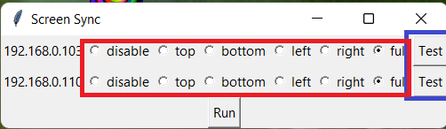

# Philips Wiz Screen Sync
[](https://www.youtube.com/watch?v=qvOY2ONg3P0)


This project allows your program to search your network for Philips Wiz lights and sync them with your screen.

The program is structured as a simple GUI that allows you to choose which parts of your screen to sync with which lights. A few key features are highlighted below:



- **Test Button** - This button will cause the lights to flicker. This is useful for identifying which light corresponds to which IP address when you're setting things up. 

- **Red square Radio Buttons** - allows you to choose which part of the screen each light should sync with. You can choose from the following options: "Full", "Left Half", "Right Half", "Top Half", "Bottom Half". 

- **Run** - run button starts the screen color sync.

- **Update Frequency** - time to wait between each sync. Better performance when it set to 0, but it increases CPU/Network usage

- **Color Processing Algorithm** - Choice of algorithm to use to process colors.
   - Median - middle color sort by RGB intensity
   - LeVibrant - chooses more vibrabt colors. Example, light saber swords in a fight scene. *Significantly Better in my opinion*

## Installation

If you're a first time user and you don't want to compile the code from source, you can simply download the ready-to-use executable file. Follow these steps:

1. Navigate to the [releases section](https://github.com/enochlev/PhilipsWizScreenSync/releases) **on the right-hand side** of the GitHub page.
2. Find the latest release and download the .exe file attached to it.
3. Run the downloaded file to start using the Philips Wiz Screen Sync application.

**Note: be sure that you are connected to the same router as the lights are.

** Yet another Note: This is my first release and I will maintain this more, add compatibilities if I get support.


If you're interested in developing this project further, you can clone the repository by running:

```bash
git clone https://github.com/enochlev/PhilipsWizScreenSync.git
```

## Compilation

For developers who want to compile the application from the source code, you need to have Python installed in your system. Here are the steps to compile it:

1. Clone the repository to your local machine:

   ```bash
   git clone https://github.com/enochlev/PhilipsWizScreenSync.git
   ```
2. Navigate to the cloned directory:

   ```bash
   cd PhilipsWizScreenSync
   ```
3. Install the required Python packages:

   ```bash
   pip install -r requirements.txt
   ```
4. Run the PyInstaller to compile the script into an executable file:

   ```bash
   pyinstaller --onefile --noconsole -n "Screen Sync" -i icon.ico --add-data "icon.ico;." --add-data "icon.gif;." pythonLights.py

   ```
5. You'll find the compiled executable in the `dist` directory. 

Enjoy your new immersive lighting experience with Philips Wiz Screen Sync!
